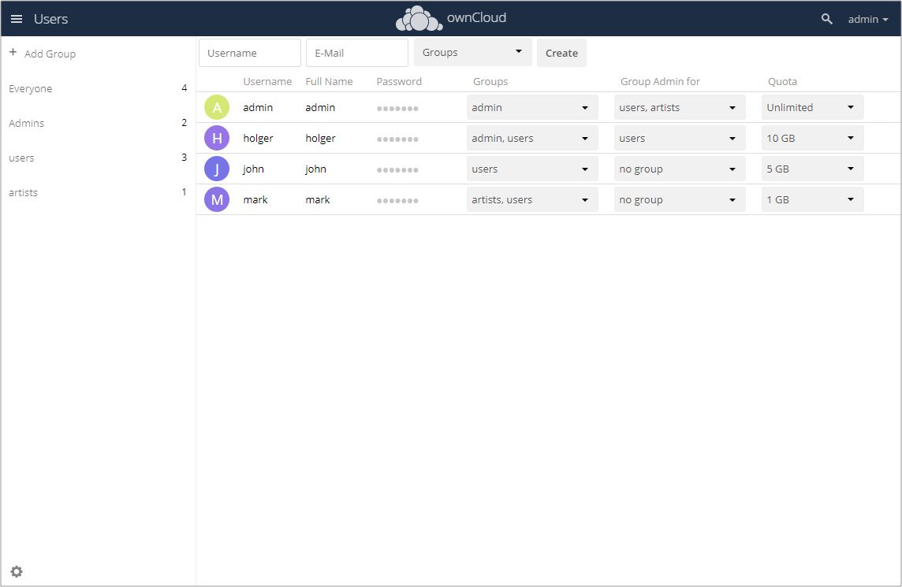
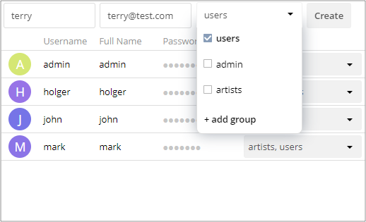

# Quickstart for Installing and Using Owncloud

## Introduction

owncloud is a cloud collaboration platform which can be deployed on your server facilities. The main purpose of using ownCloud is to share files between colleagues.

This Quickstart explains how to deploy Owncloud on a server and use it.

> All information from this Quickstart is available on [ownCloud Documentation](https://doc.owncloud.com/) page.

After you have read this document, you will learn how to:

- install ownCloud on your server,
- enable users to connect to the installed ownCloud instance,
- manage users accounts on the installed instance.

As a user, you will learn how to connect to ownCloud using desktop and mobile clients.

## Installing ownCloud server

You can install ownCloud either using a Docker image or manually.

### System and software requirements

Before installation, verify system and software requirements on [Software requirements](https://doc.owncloud.org/server/10.0/admin_manual/installation/system_requirements.html) page.

### Docker installation

Download a Docker image from the [official ownCloud Docker](https://hub.docker.com/r/owncloud/server/) page.

Prepare separate Docker containers for MariaDB/MySQL and Redis, as well as data volume in the host filesystem. The configuration of ownCloud:

- exposes port 8080, allowing for HTTP connections,

- mounts the data and MariaDB/MySQL data directories on the host for persistent storage.

Create a new project directory and download `docker-compose.yml` from [the ownCloud Docker GitHub repository](https://github.com/owncloud-docker/server.git).

Create `.env` file in the project directory and fill it with following settings:


| Setting name | Description | Example |
| ------------ |:-----------:| -------:|
| `OWNCLOUD_VERSION`| The ownCloud version | `latest` |
| `OWNCLOUD_DOMAIN`| The ownCloud domain | `localhost` |
| `ADMIN_USERNAME`| The admin username | `admin` |
| `ADMIN_PASSWORD`| The admin user’s password | `admin` |
| `HTTP_PORT`| The HTTP port to bind to | `8080` |


Start the container. You can find instructions for plain docker in the [GitHub repository](https://github.com/owncloud-docker/server#launch-with-plain-docker).

Run `docker-compose ps` command to check whether all containers have successfully started. 

Open [http://localhost:8080/](http://localhost:8080/). Here you can find a login screen. 


Use admin credentials from `.env` file to log into ownCloud.

Find more details on installation and managing ownCloud docker containers at [Installation on a Local Machine](https://doc.owncloud.com/server/10.1/admin_manual/installation/docker/#installation-on-a-local-machine) chapter.

### Manual installation

Download the latest archive with ownCloud server from [ownCloud Download Page](https://owncloud.org/install). You can verify MD5 or SHA256 sum to guarantee successful downloading.

> You can read an installation example on [Install ownCloud on Ubuntu 18.04](https://doc.owncloud.com/server/10.1/admin_manual/installation/ubuntu_18_04.html) page.

Extract the archive contents into a single ownCloud directory.

Copy ownCloud directory to its final destination. In case of Apache HTTP server it can be Apache document root. For other web servers it should be a folder outside the document root.

Configure the web server. Read more about it at [Configure the Web Server](https://doc.owncloud.com/server/10.1/admin_manual/installation/manual_installation.html#configure-the-web-server) chapter.

If you run Apache under Ubuntu, you can enable SSL with following commands:

```
a2enmod ssl
a2ensite default-ssl
service apache2 reload
```

Enable Apache Prefork. You can read more on [Apache Prefork](https://httpd.apache.org/docs/2.4/mod/prefork.html) page.

Run either the graphical or command line installation wizard. Refer to:

- [The Installation Wizard](https://doc.owncloud.com/server/10.1/admin_manual/installation/installation_wizard.html) for GUI installation, or
- [Command Line Installation](https://doc.owncloud.com/server/10.1/admin_manual/installation/command_line_installation.html) page to run a CLI version.

## Creating user accounts

Log into ownCloud. Go to Users menu item.



Right above the table, fill in three fields from the left to the right:

- login,
- email,
- users --- select from the dropdown list.

and click Create button.

> Login names may contain letters (a-z, A-Z), numbers (0-9), dashes (-), underscores (_), periods (.) and at signs (@).



You can read about other available options on [User Management](https://doc.owncloud.com/server/10.1/admin_manual/configuration/user/user_configuration.html) page.

## Enabling users to work with ownCloud

After you create user accounts, provide potential ownCloud users with following information:

- ownCloud server URL, including port 8080,
- user credentials,
- information from chapters below.

## Connecting to ownCloud

As a user, you can connect to ownCloud server by means of:

- ownCloud Desktop Client,
- ownCloud Android App,
- ownCloud iOS App.

Ask for ownCloud server URL and your credentials before you run ownCloud software for the first time.

### ownCloud Desktop Client

Using Desktop Client you can synchronize directories on your computer with ownCloud and have the latest files synchronized from ownCloud.

Desktop Client is available for MacOS X, Windows and various Linux distributions:

- Windows 7+, 
- Mac OS X 10.7+ (64-bit only),
- CentOS 6 & 7 (64-bit only),
- Debian 8.0 & 9.0,
- Fedora 25 & 26 & 27,
- Ubuntu 16.04 & 17.04 & 17.10,
- openSUSE Leap 42.2 & 42.3.

You can download the latest version of the Desktop Client from [ownCloud download page](https://owncloud.com/download/#desktop-clients).

Installation on Windows and Mac OS X is the same for any software application. You can double-click the program and launch an installation wizard.
Follow all its instructions and get software installed on your computer and configured for your account. You can find more information about installation on Windows at [Customizing the Windows Installation](https://doc.owncloud.com/desktop/installing.html#customizing-the-windows-installation) chapter.

To install Desktop Client on Linux, follow instructions on the [download page](https://owncloud.com/download/#desktop-clients).

After you have installed Desktop Client, you can read more about it on [Using the Synchronization Client](https://doc.owncloud.com/desktop/navigating.html) page.

### ownCloud mobile clients

Android and iOS clients offer several advanced features which make them very convenient and easy to use.

You can download ownCloud mobile app from Google Play and App Store.

The first time you run ownCloud app, it will asks you to provide your ownCloud server URL and credentials for your account.

To learn more about Android app, go to [Using the ownCloud Android App](https://doc.owncloud.com/android/) page.

For more information about iOS app, visit [Using the ownCloud iOS App](https://doc.owncloud.com/ios/) page.

## Miscellaneous

All information from this Quickstart is available on [ownCloud Documentation](https://doc.owncloud.com/) page.
